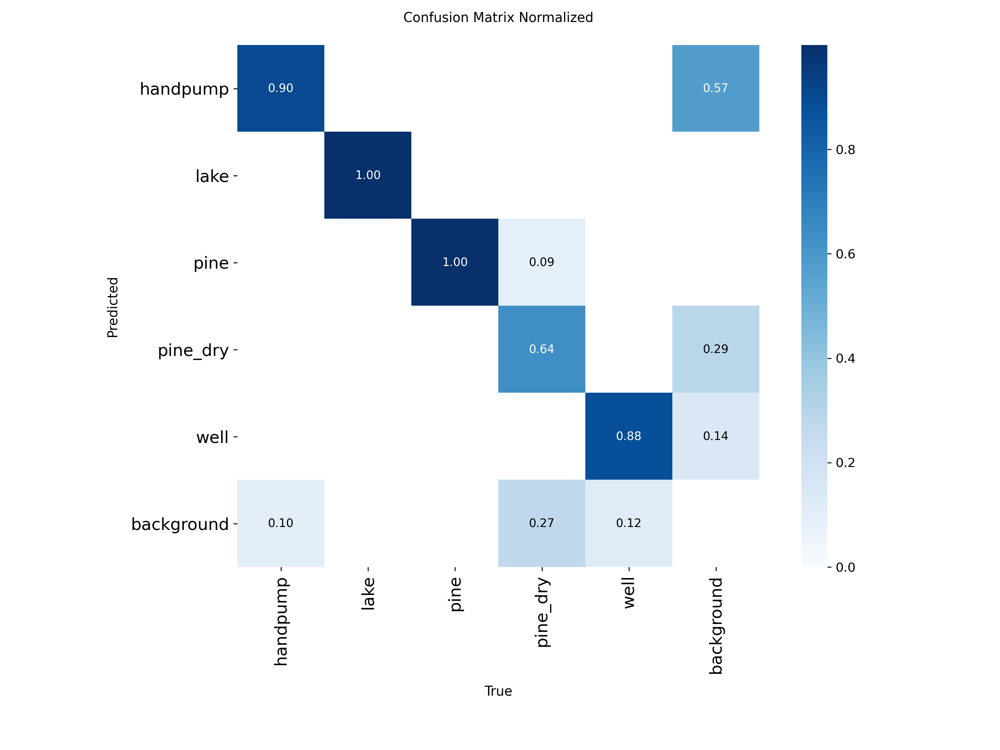
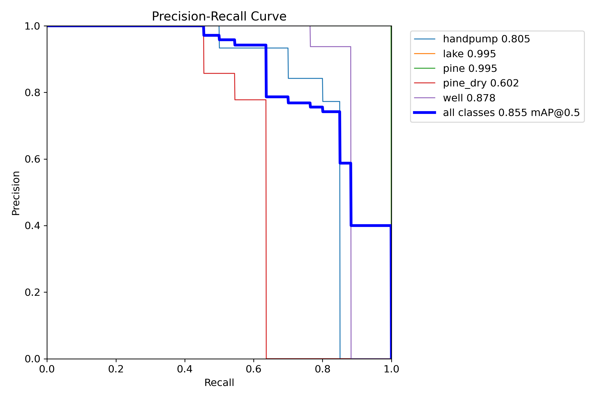
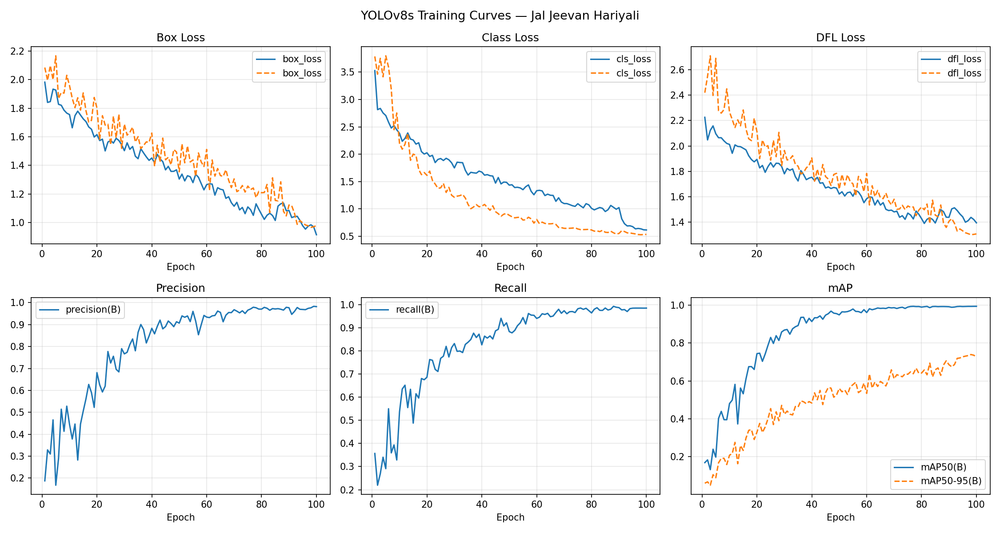
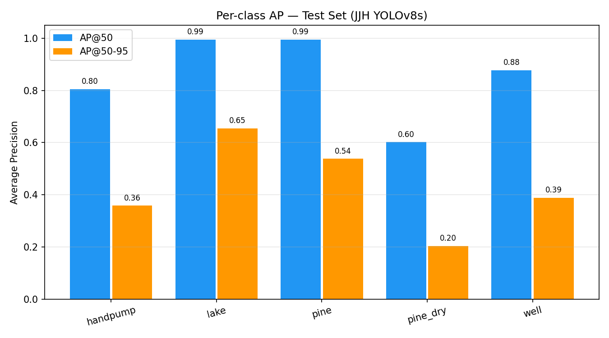
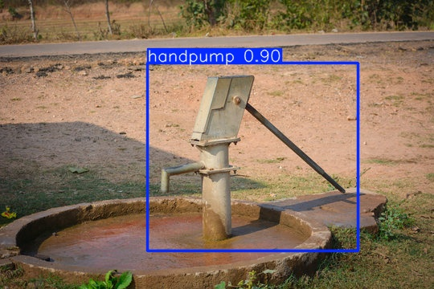
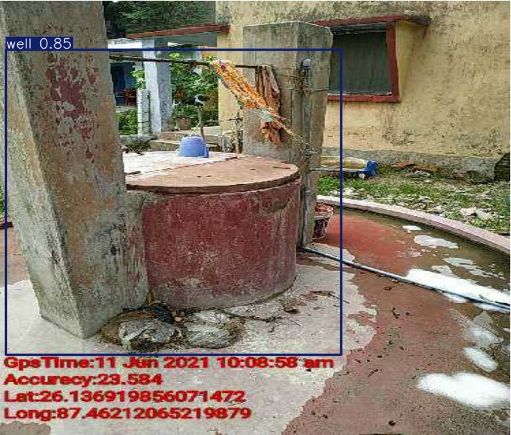
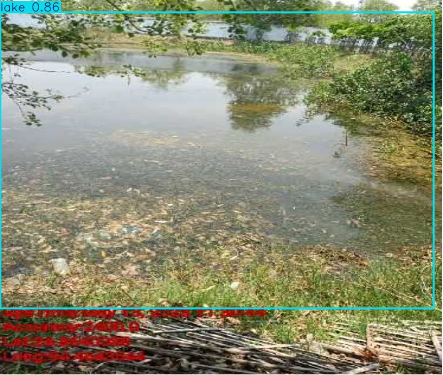

# jal-jeevan-water-resource-detection — Water Resource Detection using YOLOv8

An object detection system built on YOLOv8s that identifies rural water resources and irrigation infrastructure — handpumps, wells, lakes, and irrigation canals — from geo-tagged field images. The trained model is served through a Flask REST API that accepts base64-encoded images and returns detection results with bounding box coordinates. Built as part of the Jal Jeevan Hariyali initiative for automated asset mapping.

## Table of Contents

- [Overview](#overview)
- [Dataset](#dataset)
- [Model and Methodology](#model-and-methodology)
- [Evaluation](#evaluation)
- [Sample Predictions](#sample-predictions)
- [Project Structure](#project-structure)
- [Setup and Installation](#setup-and-installation)
- [Running the API](#running-the-api)
- [Tech Stack](#tech-stack)


## Overview

Field surveys under the Jal Jeevan Hariyali scheme generate thousands of geo-tagged photographs of rural water infrastructure. Manually classifying and locating assets like handpumps, wells, lakes, and irrigation canals in these images is time-consuming and error-prone. This project automates that process using a fine-tuned YOLOv8s object detection model that takes a field image as input and outputs bounding boxes with class labels and confidence scores for each detected asset.

The model detects five object classes:

| Class | Description |
|---|---|
| handpump | Hand-operated water pumps |
| well | Open or covered wells |
| lake | Natural or man-made water bodies |
| pine | Irrigation canals with water |
| pine_dry | Irrigation canals without water (dry) |

Irrigation canals were split into two classes (`pine` and `pine_dry`) because a single class was unable to learn the visual difference between water-filled and dry canals reliably. Separating them improved detection performance for both variants.


## Dataset

The dataset consists of geo-tagged field images collected under the Jal Jeevan Hariyali scheme. Raw annotations were provided in Pascal VOC (XML) format and converted to YOLO format using the `step1_prepare_dataset.py` script.

The dataset and raw images are hosted externally due to their size:

**[Download Dataset from Google Drive](https://drive.google.com/drive/folders/17Bkbxz6ZCxlqWoc15eE6a6gFGHr06DuV?usp=sharing)**

The Drive folder contains:
- `dataset/` — YOLO-formatted images and labels (train/test split)
- `raw_dataset/` — original images with Pascal VOC XML annotations


## Model and Methodology

### Base Model

YOLOv8s (small variant) was used as the base architecture, initialized with COCO-pretrained weights and fine-tuned on the custom dataset.

### Training Configuration

- **Epochs:** 100
- **Batch size:** 4
- **Image size:** 640 x 640
- **Device:** CPU
- **Optimizer:** SGD (lr = 1e-3, momentum = 0.937, weight decay = 5e-4)
- **Warmup:** 3 epochs

### Data Augmentation

Mosaic (1.0), mixup (0.1), rotation (±10°), vertical flip (0.3), horizontal flip (0.5), and HSV jittering were applied during training to improve generalization on a relatively small dataset.

### Annotation Conversion

The raw dataset annotations were in Pascal VOC XML format. The `step1_prepare_dataset.py` script handles the full conversion pipeline — parsing XML bounding boxes, normalizing coordinates to YOLO format (class, center_x, center_y, width, height), and organizing the output into the required directory structure.

### Training and Evaluation Pipeline

The project follows a three-step sequential pipeline:

1. **`step1_prepare_dataset.py`** — converts Pascal VOC annotations to YOLO format, organizes train/test splits, and generates `data.yaml`
2. **`step2_train.py`** — fine-tunes YOLOv8s on the prepared dataset with the configured hyperparameters and augmentations
3. **`step3_evaluate.py`** — runs test-set evaluation, generates per-class AP metrics, confusion matrix, PR curves, and sample prediction visualizations


## Evaluation

Final model: **YOLOv8s**, evaluated on the held-out test set.

| Metric | Score |
|---|---|
| mAP@50 | 0.8548 |
| mAP@50-95 | 0.4284 |
| Precision | 0.8576 |
| Recall | 0.8737 |

### Per-Class Average Precision

| Class | AP@50 | AP@50-95 |
|---|---|---|
| handpump | 0.8045 | 0.3583 |
| lake | 0.9950 | 0.6546 |
| pine | 0.9950 | 0.5377 |
| pine_dry | 0.6021 | 0.2031 |
| well | 0.8775 | 0.3885 |

`lake` and `pine` (canal with water) achieve near-perfect AP@50, while `pine_dry` (dry canal) has the lowest performance at 0.60 — likely due to the visual similarity of dry canals to general terrain.

### Confusion Matrix



### Precision-Recall Curve



### Training Curves



### Per-Class AP Chart




## Sample Predictions

Below are some detection results on the test set:

| Handpump | Well | Lake |
|---|---|---|
|  |  |  |

More predictions are available in [`runs/jjh_yolov8s/test_eval/all_predictions/`](runs/jjh_yolov8s/test_eval/all_predictions/).


## Project Structure

```
jal-jeevan-water-resource-detection/
├── api/
│   ├── app.py                  Flask REST API for model inference
│   └── encode_image.py         Utility to convert images to base64 for API testing
├── scripts/
│   ├── step1_prepare_dataset.py    Pascal VOC to YOLO format conversion
│   ├── step2_train.py              YOLOv8s fine-tuning script
│   └── step3_evaluate.py           Test-set evaluation and visualization
├── runs/
│   └── jjh_yolov8s/
│       ├── weights/
│       │   └── best.pt             Trained model weights (~22 MB)
│       └── test_eval/
│           ├── all_predictions/    Detection results on test images
│           ├── metrics/            Confusion matrix, PR curves, F1 curves
│           ├── test_per_class_ap.csv
│           ├── test_per_class_ap.png
│           └── training_curves.png
├── data.yaml                   YOLO training configuration (classes, paths)
├── requirements.txt
├── .gitignore
└── README.md
```


## Setup and Installation

**Prerequisites:** Python 3.10 or higher.

```bash
git clone https://github.com/Yuvraj428/jal-jeevan-water-resource-detection.git
cd jal-jeevan-water-resource-detection

python -m venv venv
source venv/bin/activate        # On Windows: venv\Scripts\activate

pip install -r requirements.txt
```


## Running the API

The Flask API accepts a base64-encoded image and returns detection results with class labels, confidence scores, and an annotated image.

**Start the server:**

```bash
cd api
python app.py
```

The API runs at `http://localhost:5000`.

**Endpoints:**

- `GET /` — health check
- `POST /predict` — send a base64-encoded image and receive predictions

**Example request (using Postman or curl):**

```json
{
  "image": "<base64-encoded-image-string>",
  "image_id": "test_001"
}
```

**Example response:**

```json
{
  "image_id": "test_001",
  "predictions": [
    {
      "class": "handpump",
      "confidence": 0.9012
    }
  ],
  "annotated_image": "<base64-encoded-annotated-image>"
}
```

To generate a base64 string from an image for testing:

```bash
cd api
python encode_image.py path/to/your/image.jpg
```


## Tech Stack

- **Python 3.10+**
- **Ultralytics YOLOv8** — object detection model training and inference
- **PyTorch** — deep learning backend
- **Flask** — REST API for serving predictions
- **OpenCV** — image decoding, encoding, and processing
- **NumPy / Pandas** — data processing and metrics export
- **Matplotlib** — evaluation visualizations (training curves, AP charts, confusion matrix)

Developed by Yuvraj Aarsh
